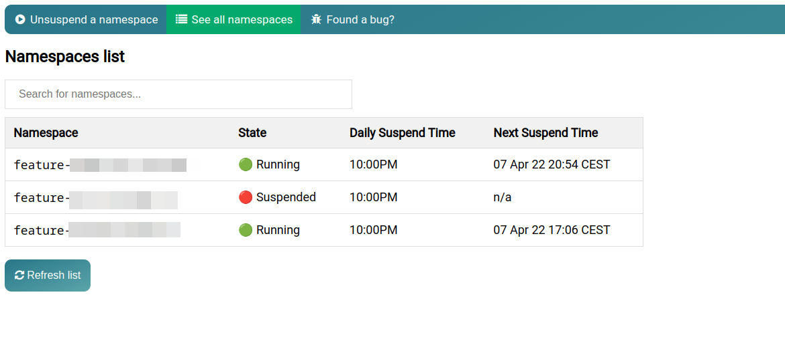
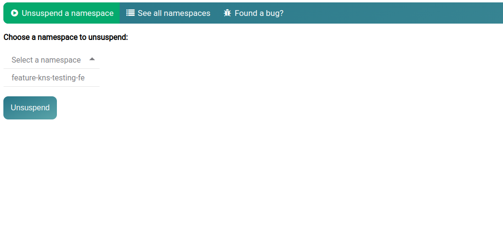

# kube-ns-suspender


Kubernetes controller managing namespaces life cycle.

- [kube-ns-suspender](#kube-ns-suspender)
  - [Goal](#goal)
  - [Installation](#installation)
  - [Usage](#usage)
    - [Internals](#internals)
      - [The watcher](#the-watcher)
      - [The suspender](#the-suspender)
    - [Flags](#flags)
    - [Resources](#resources)
    - [States](#states)
    - [Annotations](#annotations)
      - [On namespaces](#on-namespaces)
        - [**controllerName**](#controllername)
        - [**dailySuspendTime**](#dailysuspendtime)
        - [**desiredState**](#desiredstate)
        - [**nextSuspendTime**](#nextsuspendtime)
      - [On resources](#on-resources)
        - [Deployments and Stateful Sets](#deployments-and-stateful-sets)
        - [Cronjobs](#cronjobs)
    - [Metrics](#metrics)
    - [Profiling](#profiling)
  - [WebUI screenshots](#webui-screenshots)
  - [Development flow](#development-flow)
  - [Testing](#testing)
  - [Contributing](#contributing)
  - [License](#license)

## Goal

This controller watches the cluster's namespaces and "suspends" them by scaling to 0 some of the resources within those namespaces at a given time.
However, once a namespace is in a "suspended" state, it will not be restarted automatically the following day (or whatever). This allows to "reactivate" namespaces only when required, and reduce costs.

## Installation

To deploy `kube-ns-suspender`, run the following commands:

```
kubectl create ns kube-ns-suspender && \
kubectl apply -f manifests/run/base/
```

This will apply all the required resources.

> :memo:
> 
> The latest version of `kube-ns-suspender` will be deployed as the image tag used is `:latest`.

A namespace `kube-ns-suspender` will be created and the manifests will be deployed within.

## Usage

### Internals

This controller can be splitted into 2 parts:

* The watcher
* The suspender

#### The watcher

The watcher function is charged to check every X seconds (X being set by the flag `--watcher-idle` or by the `KUBE_NS_SUSPENDER_WATCHER_IDLE` environement variable) all the namespaces. When it found namespace that have the `kube-ns-suspender/controllerName` annotation, it sends it to the suspender. It also manages all the metrics that are exposed about the watched namespaces states.

#### The suspender

The suspender function does all the work of reading namespaces/resources annotations, and (un)suspending them when required.

### Flags

| Flag                 | Description                        |      Default      | Environment variable                 |
| -------------------- | ---------------------------------- | :---------------: | ------------------------------------ |
| `--controller-name`  | Unique name of the controller      | kube-ns-suspender | `KUBE_NS_SUSPENDER_CONTROLLER_NAME`  |
| `--human`            | Disable JSON logging               |       false       | `KUBE_NS_SUSPENDER_HUMAN`            |
| `--log-level`        | Log level                          |       debug       | `KUBE_NS_SUSPENDER_LOG_LEVEL`        |
| `--no-kube-warnings` | Disable Kubernetes warnings        |       false       | `KUBE_NS_SUSPENDER_NO_KUBE_WARNINGS` |
| `--pprof`            | Start pprof server                 |       false       | `KUBE_NS_SUSPENDER_PPROF` |
| `--pprof-addr`       | Address and port to use with pprof |       :4455       | `KUBE_NS_SUSPENDER_PPROF_ADDR` |
| `--prefix`           | Prefix to use for annotations      | kube-ns-suspender | `KUBE_NS_SUSPENDER_PREFIX`           |
| `--running-duration` | Running duration                   |        4h         | `KUBE_NS_SUSPENDER_RUNNING_DURATION` |
| `--timezone`         | Timezone to use                    |   Europe/Paris    | `KUBE_NS_SUSPENDER_TIMEZONE`         |
| `--ui-embedded`      | Start UI in background             |       false       | `KUBE_NS_SUSPENDER_UI_EMBEDDED`      |
| `--ui-only`          | Start UI only                      |       false       | `KUBE_NS_SUSPENDER_UI_ONLY`          |
| `--watcher-idle`     | Watcher idle duration in seconds   |        15         | `KUBE_NS_SUSPENDER_WATCHER_IDLE`     |

### Resources

Currently supported resources are:

* [deployments](#deployments-and-stateful-sets)
* [stateful sets](#deployments-and-stateful-sets)
* [cronjobs](#cronjobs)

### States

Namespaces watched by `kube-ns-suspender` can be in 2 differents states:

* Running: the namespace is "up", and all the resources have the desired number of replicas.
* Suspended: the namespace is "paused", and all the supported resources are scaled down to 0 or suspended.

### Annotations

We assume here that the prefix used (`--prefix`) is the one by default.

#### On namespaces

##### **controllerName**

In order for a namespace to be watched by the controller, it needs to have the `kube-ns-suspender/controllerName` annotation set to the same value as  `--controller-name`.

Then, the namespace will be attributed a state, which can be either `Running` or `Suspended` (depending if `kube-ns-suspender/dailySuspendTime` is past).

##### **dailySuspendTime**

To be automatically suspended at a given time, a namespace must have the annotation `kube-ns-suspender/dailySuspendTime` set to a valid value.
Valid values are any values that match the [`time.Kitchen`](https://pkg.go.dev/time#pkg-constants) time format, for example: `8:15PM`, `12:45AM`...

##### **desiredState**
 
If you want to unsuspend a namespace, you have to edit the annotation of the namespace:

`kube-ns-suspender/desiredState: Suspended` -> `kube-ns-suspender/desiredState: Running`.

To do this, you can either use the webui, do it manually with `kubectl edit` or use the dedicated [`kubectl` plugin](https://github.com/govirtuo/kubectl-suspender).

##### **nextSuspendTime**

When unsuspending a namespace, a new annotation will be added automically: `kube-ns-suspender/nextSuspendTime`.

This annotation contains the date at which the namespace will be automatically suspended again (following the format [`time.RFC822Z`](https://pkg.go.dev/time#pkg-constants)). The default value set by the controller can be tweaked with the flag `--running-duration`. The annotation value can also be edited manually if needed.

> :memo:
>
> `dailySuspendTime` has a higher priority than `nextSuspendTime`
>

#### On resources

Annotations are employed to save the original state of a resource. 

##### Deployments and Stateful Sets

As those resources have a `spec.replicas` value, they must have a `kube-ns-suspender/originalReplicas` annotation that must be the same as the `spec.replicas` value. This annotation will be used when a resource will be "unsuspended" to set the original number of replicas.

##### Cronjobs

Cronjobs have a `spec.suspend` value that indicates if they must be runned or not. As this value is a boolean, **no other annotations are required**.

### Metrics

`kube-ns-suspender` comes with its own Prometheus exporter. It starts automatically and listens on `0.0.0.0:2112` by default.

### Profiling

`kube-ns-suspender` can start a pprof server for profiling, using the flag `--pprof`. 

## WebUI screenshots

<details>
<summary>Click to see some screenshots</summary>




</details>

## Development flow

To test the modifications in real-time, this project uses [`devspace`](https://devspace.sh/). It is configured to use the manifests in `manifests/dev/`.

> :check_mark:
>
> * You can start a local Kubernetes cluster with the command: `make kind-start`
> * Then run in your shell `export KUBE_CONFIG=` the value reported :point_up:

First, set the namespace to use:

```
devspace use namespace kube-ns-suspender-testing
```

Deploy the testing namespace with mock resources:

```
kubectl apply -f manifests/testing-namespace
```

Then deploy your dev version of `kube-ns-suspender`:

```
devspace dev
```

> :warning:
> 
> `devspace` and `kubectl` will deploy the manifests in the cluster set by the current context. be sure to **not** deploy in the wrong cluster.
>

Once the dev deployment is over, you'll have access to a shell in the container. You can start developing!

When you are done, you can stop everything by closing your shell in the container and running:

```
devspace purge
```

and:

```
kubectl delete -f manifests/testing-namespace/
```

## Testing

The controller at each PR and push using [bats-detik](https://github.com/bats-core/bats-detik).

## Contributing

/* add CONTRIBUTING file at root */

## License

[MIT](https://choosealicense.com/licenses/mit/)
